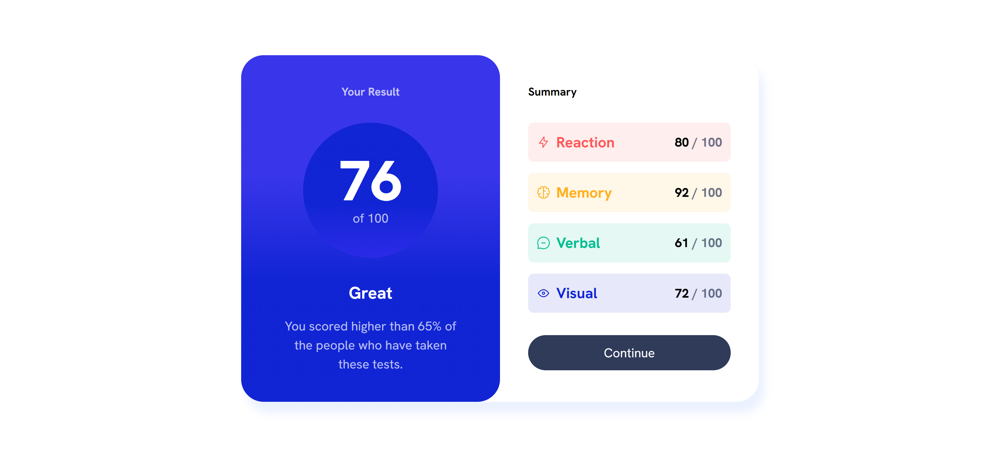
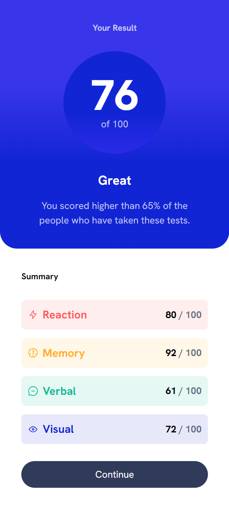

# Frontend Mentor - Results summary component solution

This is a solution to the [Results summary component challenge on Frontend Mentor](https://www.frontendmentor.io/challenges/results-summary-component-CE_K6s0maV). Frontend Mentor challenges help you improve your coding skills by building realistic projects.

## Table of contents

- [Overview](#overview)
     - [The challenge](#the-challenge)
     - [Screenshot](#screenshot)
     - [Links](#links)
- [My process](#my-process)
     - [Built with](#built-with)
     - [What I learned](#what-i-learned)
     - [Continued development](#continued-development)
     - [Useful resources](#useful-resources)
- [Author](#author)
- [Acknowledgments](#acknowledgments)

## Overview

### The challenge

Users should be able to:

- View the optimal layout for the interface depending on their device's screen size
- See hover and focus states for all interactive elements on the page

### Screenshot

#### Desktop view



#### Mobile view



### Links

- Solution URL: [solution URL here](https://www.frontendmentor.io/solutions/responsive-result-summary-component-F8BUid9162)
- Live Site URL: [live site URL](https://ckola99.github.io/results-summary-component/)

## My process

### Built with

- Semantic HTML5 markup
- CSS custom properties
- Flexbox
- CSS Grid
- Mobile-first workflow

### What I learned

I learned that data attributes can be used better than css selectors because their children elements do not inherit the padding style added to that element using a data attribute. The code snippet below shows how it was used to create the gap between the elements in the Results container (left-side of project) :

```CSS
	.grid-flow {
	display: grid;
	align-content: start;
	gap: 1rem;
}


/* This prevents the inheritance that custom properties give their children elements and creates the desired gap */
.grid-flow[data-spacing="large"] {
	gap: 2rem;
}
```

This was interesting to me because it is a cleaner way to add padding, gaps and desired looks to my layout. I also used data attributes to make the divs background color and svg color. This is a clean way of writing code because if I change the color in one place it changes that div entirely saving time and making life a lot easier with maintainable clean code, see below:

```CSS

.summary-item {
	display: flex;
	justify-content: space-between;
	align-items: center;
	padding: 0.75rem;
	border-radius: .5rem;
	background-color: hsl(var(--item-color), .1);
}

.summary-item svg {
	stroke: hsl(var(--item-color));
}

.item-title {
	color: hsl(var(--item-color));
	font-weight: var(--fw-bold);
}

.summary-item[data-item-type="accent-1"] {
	--item-color: var(--Light-red);
}

```

The code above taught me a lot about how I can use variables even as a definition in the middle of my css code and I do not only need to make it a :root.

I learned how to make padding in one spot using two rules and changing it in one area changes everything easily. I also learned how to write better media queries and effective workflow to make my projects better.

### Continued development

I personally want to use the skills and tricks I learned making this project to improve my clean css writing and clean code. I want to use this project as a building block to writing better code and use data attributes more. I also want to increase my confidence in layout skills.

### Useful resources

- [Youtube](https://youtu.be/KqFAs5d3Yl8?si=W-b5sS0Mn-ritC9V) - A bit of hand holding but this video taught me a lot about data attributes, padding, variables and custom properties.
- [MDN](https://developer.mozilla.org/en-US/) - this website is what I used to make sure I used the correct selectors and available properties.
- [ChatGPT](https://chatgpt.com) - I used chatgpt for small queries about my code where I couldn't necessarily see issues.


## Author

- Frontend Mentor - [@Ckola99](https://www.frontendmentor.io/profile/Ckola99)

## Acknowledgments

Here I would like to tip my hat to Kevin Powell and his youtube channel for teaching me new things and ways to use things I already knew in a professional manner.
